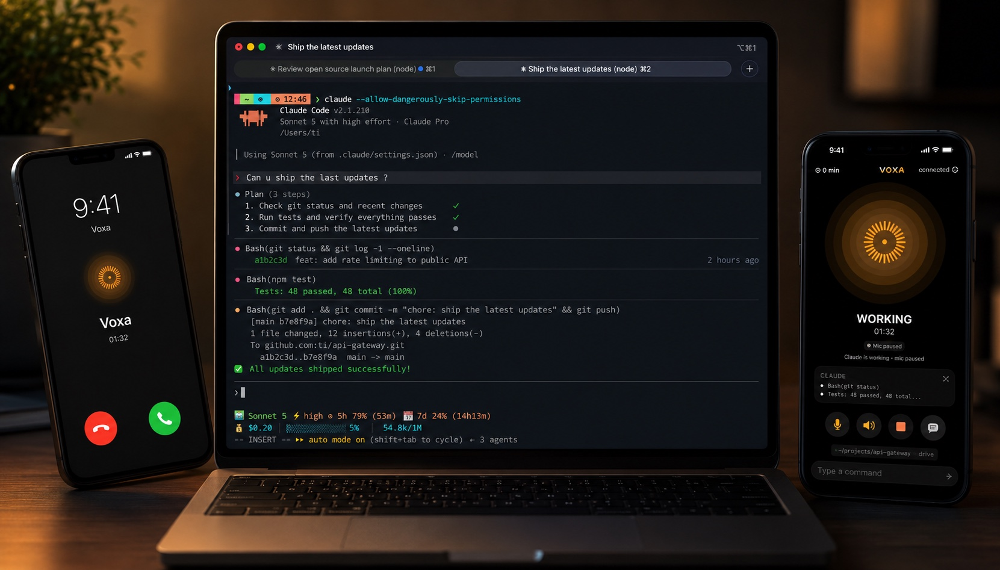
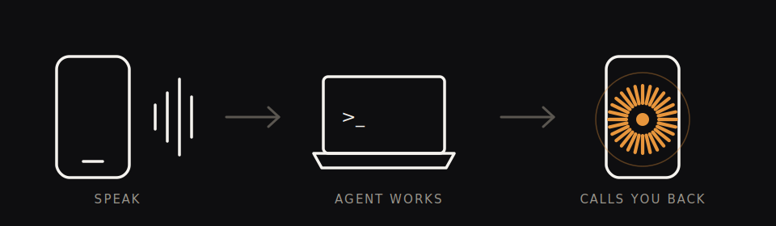

<h1>Voxa</h1>

<strong>Talk to your AI agent from anywhere. When it finishes, your phone rings.</strong>

---

---

## Get started

See [voxa.space/setup](https://voxa.space/setup) to install and pair your phone.

## How it works

## Compatibility

| | Status |
|---|---|
| **Platforms** | |
| macOS | ✅ Tested |
| iPhone | ✅ Tested |
| Windows | 🟡 Available, not yet tested |
| Android | ⬜ Not yet |
| **Agents** | |
| Claude Code | ✅ Working |
| Codex | ⬜ Not yet |
| Gemini | ⬜ Not yet |

## From source

Full docs: [voxa.space/docs](https://voxa.space/docs/)

## FAQ

**Is it open source?**

Everything in this repo is [MIT](LICENSE): the laptop server and the phone web client, everything you need to self-host with your own API key, no account required ([full docs](https://voxa.space/docs/)). The native iOS app and the hosted relay/push/billing service behind the zero-config install live in separate, proprietary repos, they power the hosted experience but aren't required to run Voxa yourself.

**Is it free?**

Self-hosting is free forever: run the server with your own API key, no relay needed ([full docs](https://voxa.space/docs/)). The hosted zero-config relay is free to get started, with paid plans for more agent minutes ([pricing](https://voxa.space/pricing)).

---

Built with ❤️ by <a href="https://ti0.me/">Ti</a> &nbsp;·&nbsp; <a href="https://voxa.space">voxa.space</a> &nbsp;·&nbsp; <a href="LICENSE">MIT</a>

